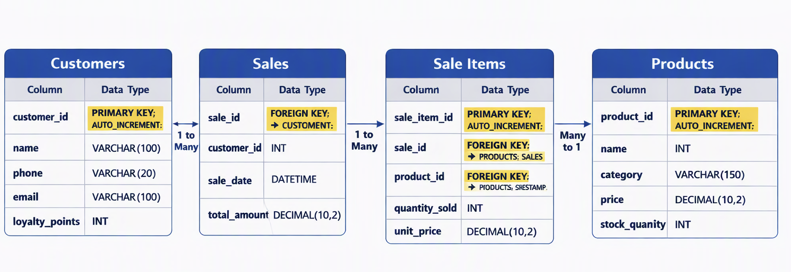
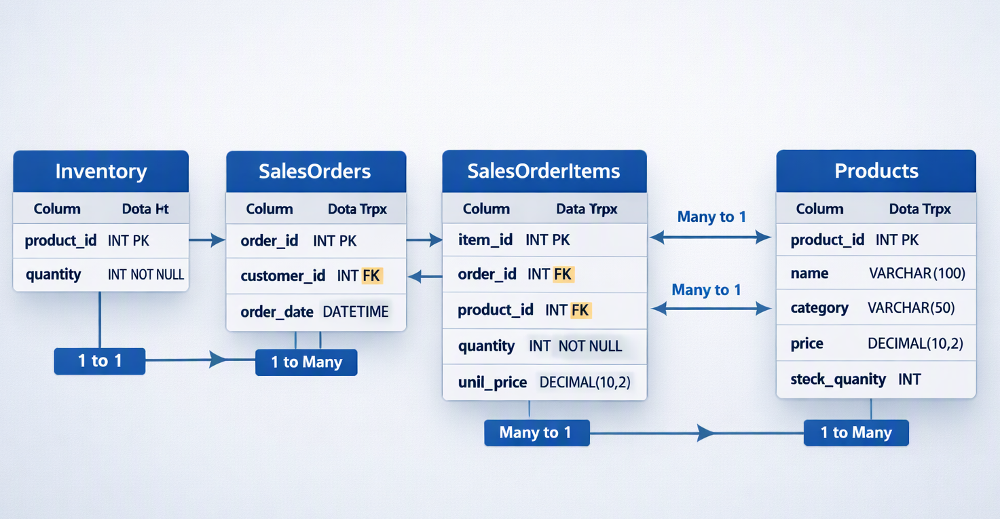

# SQL Basic Concepts & Project
## Introduction

This repository demonstrated basic concepts about SQL and using SQL to extract and process data. Including primary key, foreign key, relational and non-relational dataset. It also shows basic syntax and understand how to implement data manipulation and filtering. To further extend knowledge and understanding of SQL, the project demonstrated how to work with subqueries, group data, work with null values and tables.

## Skills Demonstrated

### Database
- Primary Key & Secondary Key.
- The relationship between primary key and foreign key.
- The types of relationship: one-to-one, one-to-many, many-to-one.
- Relational and non-relational database.
- JOIN types: Self-join, Right join, Left join, Full join, Inner join, Cross join.

### Project Simulation

### Background

Imagine you have been hired by a small retail business that wants to streamline its operations by creating a new database system. This database will be used to manage inventory, sales, and customer information. The business is a small corner shop that sells a range of groceries and domestic products. It might help to picture your local convenience store and think of what they sell. They also have a loyalty program, which you will need to consider when deciding what tables to create. 

### Task 1

1.	Understanding the Business Requirements:
a.	What kind of data will the database need to store?
b.	Who will be the users of the database, and what will they need to accomplish?

For set the database we could include different tables like Products, Customers, Sales and Sale items. 
- In Products table could include Product ID as primary key, Name, Category, Price and Stock Quantity. 
- In Customers table could include Customer ID as primary key, Name, Phone, Email and Loyalty points. 
- In Sales table include Sale ID as primary key, Customer ID as foreign key, Sale Date and Total Amount. 
- In Sale Items table include Sale Item ID as primary key, Sale ID as foreign key, Product ID as foreign key, Quantity Sold and Unit Price.

These tables will be used by different stuffs after creating. The cashier can use these tables for recording. The manager can use these tables for analysing and generate report. The shop holders can use these tables for calculating the profit and make plans.

### Task 2

2.	Designing the Database Schema:
a.	How would you structure the database tables to efficiently store inventory, sales, and customer information?
b.	What relationships between tables are necessary (e.g., how sales relate to inventory and customers)?



### Task 3
3.	Implementing the Database:
a.	What SQL commands would you use to create the database and its tables?
b.	Provide examples of SQL statements for creating tables and defining relationships between them.

We need to use CREATE TABLE command to create table first. And then INSERT INTO command for add rows into table. Using UPDATE command to refresh incorrect data. We also need to use DELETE FROM command to delete rows which we don’t need any more. We could use ALTER TABLE ADD command to add new columns while DROP command to delete columns.

```
e.g.  CREATE TABLE Customers(
	customer_id INT PRIMARY KEY AUTO_INCREMENT,
	first_name VARCHAR(50),
	last_name VARCHAR(50),
	email VARCHAR(100) UNIQUE,
	phone VARCHAR(20),
	address VARCHAR(255),
	created_at DATETIME DEFAULT CURRENT_TIMESTAMP
);
```
```
CREATE TABLE Products (
    product_id INT PRIMARY KEY AUTO_INCREMENT,
    product_name VARCHAR(100) NOT NULL,
    category VARCHAR(50),
    unit_price DECIMAL(10,2) NOT NULL,
    cost DECIMAL(10,2),
    created_at DATETIME DEFAULT CURRENT_TIMESTAMP
);
```
```
CREATE TABLE Inventory (
    product_id INT PRIMARY KEY,
    quantity_in_stock INT NOT NULL,
    reorder_level INT DEFAULT 0,
    last_updated DATETIME DEFAULT CURRENT_TIMESTAMP,
    FOREIGN KEY (product_id) REFERENCES Products(product_id)
);
```
```
CREATE TABLE SalesOrders (
    order_id INT PRIMARY KEY AUTO_INCREMENT,
    customer_id INT NOT NULL,
    order_date DATETIME DEFAULT CURRENT_TIMESTAMP,
    total_amount DECIMAL(10,2),
    payment_method VARCHAR(50),
    status VARCHAR(20),
    FOREIGN KEY (customer_id) REFERENCES Customers(customer_id)
);
```
```
CREATE TABLE SalesOrderItems (
    order_item_id INT PRIMARY KEY AUTO_INCREMENT,
    order_id INT NOT NULL,
    product_id INT NOT NULL,
    quantity INT NOT NULL,
    unit_price DECIMAL(10,2) NOT NULL,
    line_total DECIMAL(10,2) GENERATED ALWAYS AS (quantity * unit_price) STORED,
    FOREIGN KEY (order_id) REFERENCES SalesOrders(order_id),
    FOREIGN KEY (product_id) REFERENCES Products(product_id)
);
```



### Task 4

4.	Populating the Database:
a.	How would you input initial data into the database? Give examples of SQL INSERT statements.

When input initial data into the database there is an example below:

```
INSERT INTO Products (product_id, product_name, category, unit_price, cost) VALUES (1, ‘Cake’, Foods, 2, 1)
```

For maintaining the database, I need to keep a database accurate and up to date. 
I would:
- Enforce data integrity constraints.
- Use transactions.
- Implement triggers.
- Schedule maintenance jobs.
- Validate data at the application layer.
- Maintain audit logs.
- Optimize with indexes.
- Perform regular data-quality checks.
- Ensure robust backups.
- Apply role-based access control.

### Task 5

5.	Maintaining the Database:
a.	What measures would you take to ensure the database remains accurate and up to date?
b.	How would you handle backups and data security?

To ensure backups and data security, I would implement a multi-layered strategy: 
- Automated full and incremental backups stored in multiple locations.
- Regular restore testing.
- Encryption at rest and in transit.
- Strict role-based access control.
- Strong authentication.
- Network isolation.
- Continuous monitoring.
- Regular patching.

This ensures the database is both recoverable and secure against threats.
